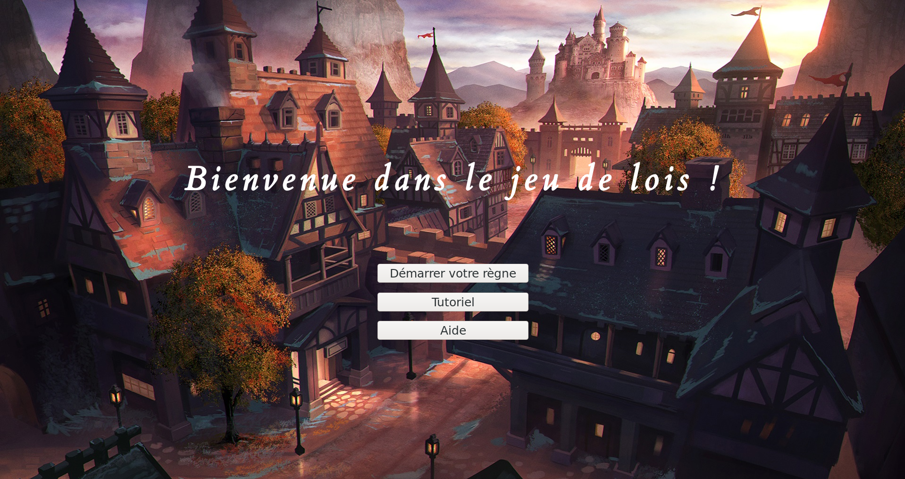
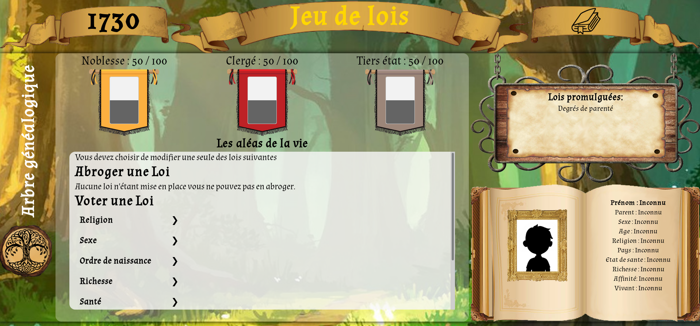
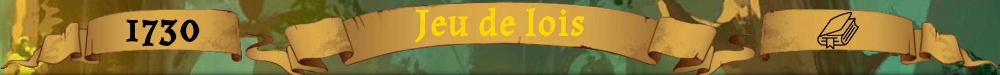
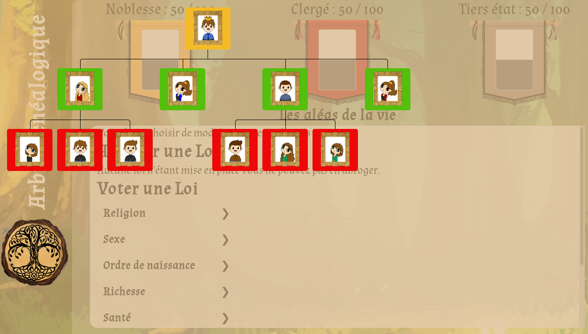
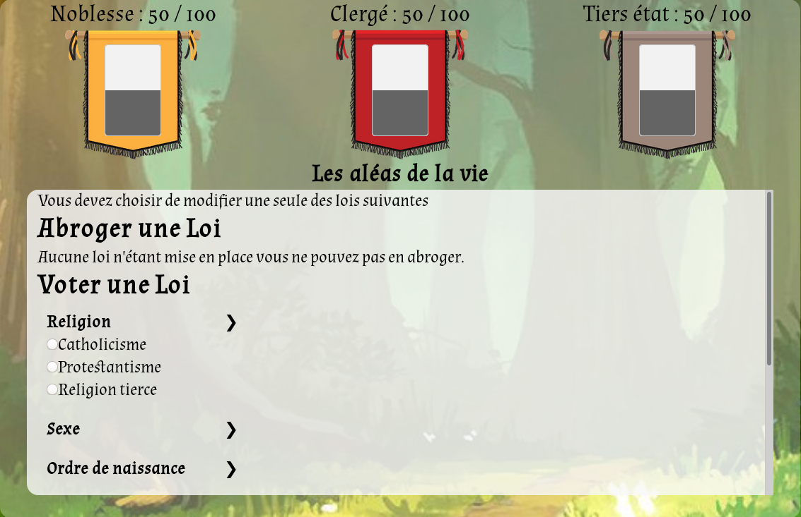
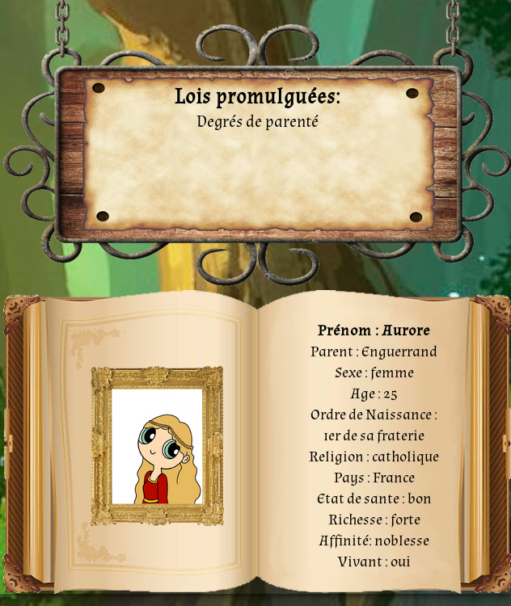
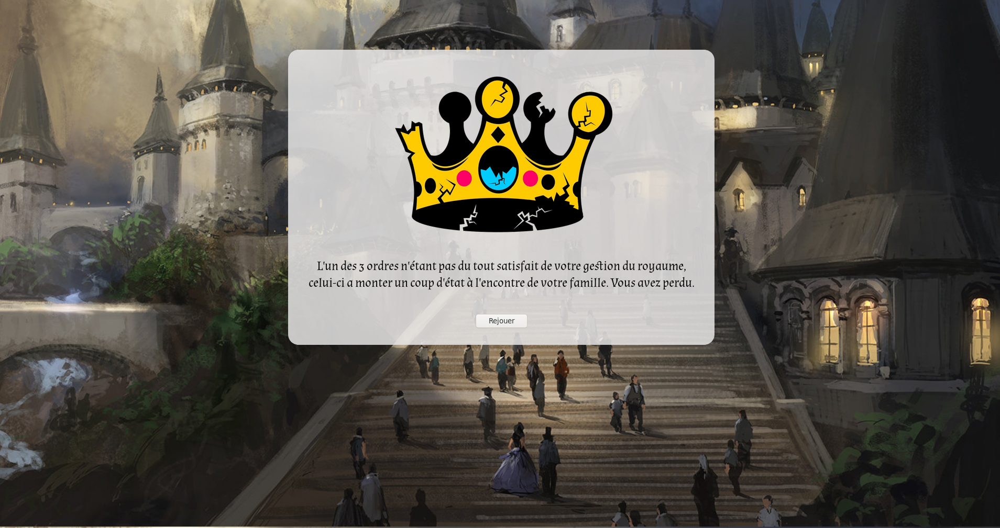

**I - Présentation**

 a) Le projet
 
> * Ce projet a été réalisé par : Félix Gander, Axel Grimmer et Sarah Schwaiger

Le Jeu de Lois résulte d'un projet tuteuré, ayant pour but la création d'un jeu sérieux permettant à enseigner des connaissances sur un domaine précis.
Dans notre cas, l'objectif était de faire comprendre au joueur que les lois sont apparues à la suite de nombreux processus complexes et qu'elles n'ont rien d'absolu ou d'objectif.

Vous pouvez retrouver en détail les objectifs pédagogiques dans le [Wiki associé.](https://git.unistra.fr/T432_ECR19_T3_D/le_jeu_de_lois/wikis/Informations-p%C3%A9dagogiques)

Au-delà des objectifs pédagogiques, l'organisation du projet devait respecter diverses règles comme par exemple l'utilisation de l'outil Git comme plateforme de partage du code source.

  b) Le jeu

Concernant le jeu en lui même, l'action se passe au Moyen-Âge, lors de l'émergence de nouvelles lois de successions au trône.
Le but est de mainenir votre ligné sur le trône en votant ou abrogeant les lois proposées par le jeu.
La complexité du jeu réside dans le fait que les décisions prises sur les lois impactes les relations de la couronne avec les trois grandes classes sociales de cette période :
- Le clergé
- La noblesse
- Le tiers-état

Les règles plus approndies sont aussi décrites dans un [Wiki associé.](https://git.unistra.fr/T432_ECR19_T3_D/le_jeu_de_lois/wikis/R%C3%A8gles-du-Jeu)

  
 
**II - Informations pratiques**

Afin de visualiser le jeu, voici quelques captures d'écran du jeu :

Tout d'abord, le menu principal :

  
 
 - Il permet de se rediriger sur des pages d'explications du jeu ou bien de commencer une partie.
 

Ensuite le jeu se présente sous la forme suivante :

  
 
Vous pouvez voir sur cette capture d'écran plusieurs zones de jeux et d'affichages, des explications plus précisent seront présentées dans le tutoriel.

Pour résumer rapidement les différentes parties, il y a : 
 - Le bandeau supérieur informatif
  

 - L'arbre généalogique rétractable sur la gauche, se lance sur une page annexe une fois trop large
 

 - La partie centrale regroupant les jauges des classes et les actions de jeux
 

 - L'affichage des lois et des personnages sur la droite
 

Les derniers écrans de jeux possibles sont ceux de victoire et de défaite, en voici des exemples car ils varient selon la façon dont vous perdez :

  

  

**III - Lancement**

Le jeu est facilement accessible à l'adresse web suivante : 
→ https://webetu.iutrs.unistra.fr/~fgander/ProjetT/le_jeu_de_lois/pageDeLancement/acceuil.php

Pour des questions de visibilité, sur certaines résolutions il est préférable de règler le zoom à 70%.

Il n'y a aucune installation préalable à réaliser, il suffit juste de jouer !

 

**IV - Réutilisation**

Une archive du projet est disponible en téléchargeant depuis Git le projet, elle regroupe les pages utilisées pour le projet.

La documentation de ce projet se trouve [ici.](https://webetu.iutrs.unistra.fr/~fgander/ProjetT/le_jeu_de_lois/documentation/html/annotated.html) 

Du côté de l'hébergement, nous avons utilisé celui fourni par l'IUT via webetu. 
Afin de reproduire ce lien entre la base PHP MyAdmin et le serveur, il faut que votre page web soit héberger, voici un hébergeur que vous pouvez choisir : https://www.one.com. 
Une fois votre site web hébergé, vous devrez créer une base de données sur PHP MyAdmin, voici un tutoriel vous permettant de le faire : https://openclassrooms.com/fr/courses/918836-concevez-votre-site-web-avec-php-et-mysql/913893-phpmyadmin.

